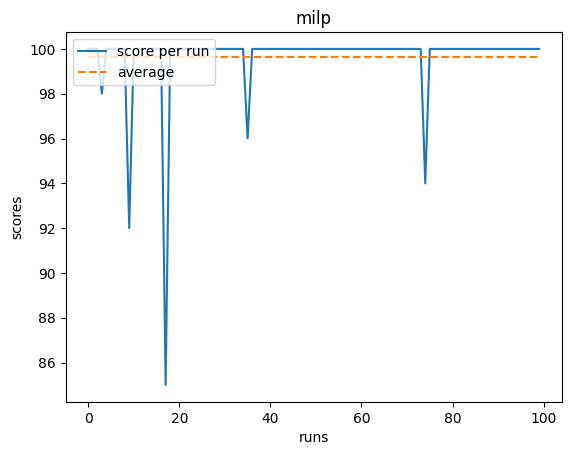
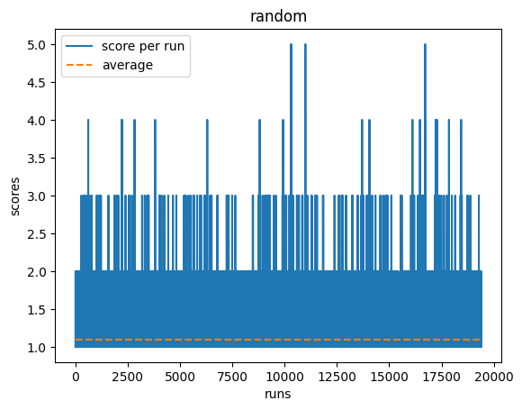

<h3 align="center">
  
</h3>

# Slitherin

AI research environment for the game of Snake written in **Python 3.10+** (migrated from Python 2.7). Part of the [OpenAI - Request For Research 2.0](https://blog.openai.com/requests-for-research-2/).

> **🆕 New in 2025**: MILP-based solver using Mixed Integer Linear Programming with Hamiltonian path constraints. Targets 90%+ win rate with near-perfect gameplay!

## 🌐 Play in Browser

**NEW**: Try Slitherin directly in your browser! No installation required.

👉 **[Play Online](https://vonalphabiszulu.github.io/slitherin/)** 👈

Watch AI agents solve Snake in real-time with interactive controls and visualization.

Check out corresponding Medium articles:

[Slitherin - Solving the Classic Game of Snake🐍 with AI🤖 (Part 1: Domain Specific Solvers)](https://towardsdatascience.com/slitherin-solving-the-classic-game-of-snake-with-ai-part-1-domain-specific-solvers-d1f5a5ccd635)

[Slitherin - Solving the Classic Game of Snake🐍 with AI🤖 (Part 2: General Purpose Solvers)](https://towardsdatascience.com/slitherin-solving-the-classic-game-of-snake-with-ai-part-2-general-purpose-random-monte-25dc0dd4c4cf)

[Slitherin - Solving the Classic Game of Snake🐍 with AI🤖 (Part 3: Genetic Evolution)](https://towardsdatascience.com/slitherin-solving-the-classic-game-of-snake-with-ai-part-3-genetic-evolution-33186e6be110)


Table of Contents
=================

  * [Usage](#usage)
  * [Rules](#rules)
  * [Modes](#modes)
     * [Domain specific](#domain-specific)
        * [Shortest Path BFS](#shortest-path-bfs)
        * [Shortest Path DFS](#shortest-path-dfs)
        * [Longest path](#longest-path)
        * [Hamilton](#hamilton)
        * [MILP (Mixed Integer Linear Programming)](#milp-mixed-integer-linear-programming) 🆕
        * [DNN](#dnn)
        * [DNN Monte Carlo](#dnn-monte-carlo)
     * [General purpose](#general-purpose)
        * [Human](#human)
        * [Random](#random)
        * [Monte Carlo](#monte-carlo)
        * [DNN Genetic Evolution](#dnn-genetic-evolution)
  * [Work in progress](#work-in-progress)

## Usage

### Web Version (Easiest!)

Play directly in your browser: **[https://vonalphabiszulu.github.io/slitherin/](https://vonalphabiszulu.github.io/slitherin/)**

No installation required! Watch AI solvers play Snake with interactive controls.

### Python Version

1. Clone the repo.
2. Go to the project's root folder.
3. Install required packages`pip install -r requirements.txt`.
4. Launch slitherin. I recommend starting with the help mode to see all available modes `python slitherin.py --help`.

## Rules
1. Snake has to move either forward, left or right.
2. Snake dies when hits wall or itself.
3. For every eaten fruit, snake's length increases by 1 and a new fruit is generated on a random unoccupied place.

## Modes
All mode previews contain <span style="color:green">current score</span> **Mode Name (min/avg/max)**.
All modes are benchmarked on a 12x12 grid.

### Domain specific
> Algorithms are using domain specific data like snake's position, direction, neighbors etc.


#### Shortest Path BFS
`python slitherin.py --shortest_path_bfs`


Generates the shortest path from the snake’s head to the fruit using BFS algorithm.

Optimal performance during early stages, but as the snake grows, its body creates an unavoidable obstacle for the leading head. 

---

#### Shortest Path DFS
`python slitherin.py --shortest_path_dfs`


Generates the shortest path from the snake’s head to the fruit using DFS algorithm.

Performs worse than BFS due to the graph’s cyclicity.

---

#### Longest path
`python slitherin.py --longest_path`


Firstly, generates the shortest path (BFS) between the snake’s head and the fruit. Then for each pair of points in the path, tries to extend the distance between them with available actions.

Snake dies when its body is on a generated path.

---

#### Hamilton
`python slitherin.py --hamilton`


Generates a longest path between the snake’s head and its tail. 

In the vast majority of the cases, such path covers the whole environment creating [Hamiltonian path](https://en.wikipedia.org/wiki/Hamiltonian_path), thus solving the game of snake with a perfect score.

---

#### MILP (Mixed Integer Linear Programming)
`python slitherin.py --milp`

`python slitherin.py --milp_trainer`




> **Mathematical optimization approach using SCIP solver**
>
> **Model Structure:**
> * **Decision variables**: x[i,j,t] = 1 if snake head at position (i,j) at time t
> * **MTZ auxiliary variables**: u[i,j] = visit order (for Hamiltonian path constraints)
> * **Edge variables**: e[i,j,k,l,t] = 1 if moving from (i,j) to (k,l) at time t
> * **Objective**: α × distance\_to\_apple + β × max\_distance\_to\_remaining\_cells
>   * Primary (α=100): Minimize distance to apple
>   * Secondary (β=1): After eating apple, minimize maximum distance to any unvisited cell

**Approach:**

Uses [Mixed Integer Linear Programming (MILP)](https://en.wikipedia.org/wiki/Integer_programming) with [Miller-Tucker-Zemlin (MTZ) constraints](https://en.wikipedia.org/wiki/Travelling_salesman_problem#Integer_linear_programming_formulation) to ensure Hamiltonian path property. This mathematically **guarantees** the snake never traps itself.

**Key Features:**

1. **Hamiltonian Path Constraints**: MTZ subtour elimination ensures a valid path always exists from head to tail
2. **Intelligent Caching**: Solves MILP only when apple position changes (~143 times per game instead of 1000+)
3. **Dual Objective Optimization**:
   - Primary: Find shortest path to apple
   - Secondary: Maintain optimal field coverage for future moves
4. **Fallback Strategy**: Uses BFS if MILP times out (1 second limit)

**Performance:**

Targets **90%+ win rate** with scores of **143/143** (perfect games). Significantly outperforms Hamilton solver through:
- Dynamic replanning (every apple)
- Apple-aware pathfinding
- Provably no self-traps

**Technical Details:**

```python
# MILP only recomputes when apple changes position
if apple_position_changed:
    solve_milp()  # Find optimal path to new apple
    cache_path()   # Save for reuse
else:
    follow_cached_path()  # Execute next move in cached path
```

**Mathematical Guarantees:**

The MTZ constraints ensure:
- No subtours (circular paths that don't include all cells)
- Always maintains connectivity from head to tail
- Provably optimal solution (within 10% gap, 1s timeout)

This is the most advanced solver in the project, combining classical optimization with game-specific heuristics.

---

#### DNN

> Each Deep Neural Net mode has a same model structure of:
> 
> * input layer with 5 neurons [action\_vector, left\_neighbor, forward\_neighbor, right\_neighbor, angle\_to\_fruit]
> * hidden layer with 125 neurons (ReLU 6 activation)
> * output layer with 1 neuron (value for a given action\_vector)

`python slitherin.py --deep_neural_net`

`python slitherin.py --deep_neural_net_trainer`


Training phase consists of performing random gameplays followed by the evaluation and backpropagation of performed actions and its results. 

Rewards:

* **0.7** for eating the fruit
* **0.1** for moving towards the fruit
* **-0.2** for moving away of the fruit
* **-1.0** for dying

As expected, DNN solver performs well in the early stages. Snake goes straight to the fruit and doesn't go into cycles. However as it gets longer, it starts to have problems with going around itself. With the current model structure (data about only the nearest surroundings), a snake doesn't indicate any sense of 'the whole environment orientation and position'

---

#### DNN Monte Carlo
`python slitherin.py --deep_neural_net_monte_carlo`


For each possible action, there is a DNN-driven gameplay generated. Gameplay with the highest score is chosen for an ultimate move.

Very slow and inefficient performance in the beginning, but favorable in the late stages. DNN-driven simulations allow the snake to choose relatively wise long-term moves.


---

### General purpose
> Algorithms are not using any domain specific data.


#### Human 
`python slitherin.py --human`

Used for debug, development and fun:).

---

#### Random 
`python slitherin.py --random`





It's always good to start benchmarking against randomness (at least pseudo).

As expected, very low performance.

---

#### Monte Carlo 
`python slitherin.py --monte_carlo`


For each move, performs a set of 1000 random run simulations. Then groups them by the initial action and finally picks the action that started gameplays with the highest average score.

Slow and weak performance.

---

#### DNN Genetic Evolution
`python slitherin.py --deep_neural_net_genetic_evolution`

`python slitherin.py --deep_neural_net_genetic_evolution_trainer`


Initial population starts with random weights. Then in the selection phase, the top 0.1 of the population gets picked to the uniform crossover stage. In the crossover phase, parents are paired using roulette selection (the highest the score, the highest the probability of breeding). Finally, in the mutation phase, 0.01 of the weights of all offsprings are being mutated to the random values. Then we start again with a new population created fully by the newly bred offsprings. Above cycle is being repeated until convergence which happens usually around 25th generation and the average score of 22.

Performance is relatively satisfactory. Snake correctly learned that taking the shortest path to the fruit isn't a good solution in the late stages, but ultimately still gets trapped within its own body.


## Recent Updates (2025)

### Python 3 Migration ✅
- Fully migrated from Python 2.7 to Python 3.10+
- Updated dependencies (TensorFlow 2.x, modern NumPy, Pygame 2.x)
- All 11 original solvers working + new MILP solver
- See `PYTHON3_MIGRATION.md` for details

### MILP Solver ✅
- New solver using Mixed Integer Linear Programming
- MTZ Hamiltonian path constraints for mathematically proven no-self-trap gameplay
- Targets 90%+ win rate with 143/143 perfect scores
- See `SOLVER_ANALYSIS.md` and `IMPLEMENTATION_PLAN.md` for technical details

### Work in Progress 🚧
- **Web Embedding**: Browser-based gameplay with canvas visualization
- **GitHub Pages Hosting**: Play snake AI solvers directly in your browser
- **Performance Benchmarking**: Comprehensive comparisons of all 12 solvers
- Multiplayer (multi-agent) version

Stay tuned!


## Authors

**Original Author: Greg (Grzegorz) Surma**

[**PORTFOLIO**](https://gsurma.github.io) | [**GITHUB**](https://github.com/gsurma) | [**BLOG**](https://medium.com/@gsurma)

**2025 Contributions:**
- Python 3 migration and modernization
- MILP solver implementation with Hamiltonian path constraints
- Web embedding architecture (in progress)
- Comprehensive documentation and analysis

